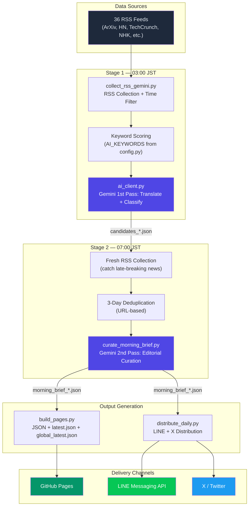

<p align="center">
  <h1 align="center">🤖 AI News Bot</h1>
  <p align="center">
    <strong>Global AI Intelligence → Japanese Morning Brief, Fully Automated</strong>
  </p>
  <p align="center">
    <a href="https://github.com/TadFuji/ai-news-bot/actions/workflows/daily_rss_gemini.yml"></a>
    <a href="https://github.com/TadFuji/ai-news-bot/actions/workflows/collect_candidates.yml"></a>
    <a href="https://opensource.org/licenses/MIT"></a>
    <a href="https://www.python.org/downloads/"></a>
    <a href="https://deepmind.google/technologies/gemini/"></a>
  </p>
  <p align="center">
    <a href="https://tadfuji.github.io/ai-news-bot/">📰 Live Portal</a> ·
    <a href="#-quickstart">⚡ Quickstart</a> ·
    <a href="#-architecture">🏗️ Architecture</a> ·
    <a href="#-contributing">🤝 Contributing</a>
  </p>
</p>

---

## 📖 Overview

AI News Bot is a **serverless, multi-stage news curation pipeline** that transforms the daily flood of global AI news into a concise, Japanese-language morning brief for technology leaders and business professionals.

**Key Value Proposition:** No servers to maintain, no databases to manage, no costs beyond API usage — the entire pipeline runs on GitHub Actions and deploys to GitHub Pages.

### What It Does

| Stage | Time (JST) | Process | Output |
|-------|-----------|---------|--------|
| **Discovery** | 03:00 | Crawl 36 RSS feeds, keyword scoring | ~100 raw candidates |
| **1st Pass** | 03:00 | Gemini analysis: translate, score, classify | Top 30 scored articles |
| **2nd Pass** | 07:00 | Editorial curation: theme, commentary, dedup | Final Top 10 brief |
| **Delivery** | 07:00 | Multi-channel distribution | Web, LINE, X (Twitter) |
| **Weekly** | Sun 09:00 | AI-written essay-style column | Column + LINE push |

### Delivery Channels

- 🌐 **[GitHub Pages Portal](https://tadfuji.github.io/ai-news-bot/)** — Daily & Global archive with dark-mode UI
- 📱 **LINE** — Top 3 push notification with share button (Flex Message)
- 🐦 **X (Twitter)** — Long-form thread with link-in-reply strategy

---

## 🏗️ Architecture



### Resilience Design

- **Retry with Backoff** — Gemini API calls retry up to 2× with exponential backoff
- **Graceful Fallback** — On API failure, pre-translated fields (`title_ja`, `summary_ja`) are used
- **Health Monitoring** — Fallback triggers a LINE alert and `exit(1)` to turn GitHub Actions red
- **Deduplication** — 3-day rolling window prevents repeated articles

---

## 📂 Project Structure

```
ai-news-bot/
├── .github/workflows/          # GitHub Actions (daily, weekly, lint)
│   ├── daily_rss_gemini.yml    #   Main pipeline: Stage 1 + Stage 2
│   ├── collect_candidates.yml  #   Stage 1 only (03:00 JST)
│   ├── weekly_column.yml       #   Sunday column generation
│   └── lint.yml                #   Code quality checks
│
├── config.py                   # RSS sources (36), AI keywords, settings
├── rss_client.py               # RSS feed parser (feedparser wrapper)
│
├── collect_rss_gemini.py       # Stage 1: Collect + Score + 1st Gemini pass
├── ai_client.py                # Gemini API client (prompts, fallback logic)
├── curate_morning_brief.py     # Stage 2: 2nd Gemini pass + orchestration
│
├── build_pages.py              # Static site generator (JSON/HTML for Pages)
├── distribute_daily.py         # Multi-channel distribution orchestrator
├── line_notifier.py            # LINE Messaging API (Flex Message support)
│
├── generate_weekly_column.py   # AI-written weekly essay column
├── db_utils.py                 # Shared database utilities
├── save_to_db.py               # Daily news → SQLite/MySQL
├── save_global_news.py         # Global news → SQLite/MySQL
├── monitor_models.py           # Monthly AI model release tracker
│
├── app.py                      # Streamlit dashboard (local admin UI)
├── generators/                 # PDF report & video generators
├── docs/                       # GitHub Pages (published directory)
├── output/                     # Intermediate artifacts (gitignored)
│
├── .env.example                # Environment variable template
├── requirements.txt            # Python dependencies
├── CONTRIBUTING.md             # Contribution guidelines
├── HISTORY.md                  # Detailed changelog
└── LICENSE                     # MIT License
```

---

## ⚡ Quickstart

### Prerequisites

- Python 3.10+
- [Google AI Studio API Key](https://aistudio.google.com/apikey) (for Gemini)

### Installation

```bash
# Clone the repository
git clone https://github.com/TadFuji/ai-news-bot.git
cd ai-news-bot

# Create virtual environment
python -m venv .venv
source .venv/bin/activate  # Linux/macOS
# .venv\Scripts\activate   # Windows

# Install dependencies
pip install -r requirements.txt

# Configure environment
cp .env.example .env
# Edit .env with your API keys
```

### Environment Variables

| Variable | Required | Description |
|----------|----------|-------------|
| `GOOGLE_API_KEY` | ✅ | Google AI Studio API key for Gemini |
| `LINE_CHANNEL_ACCESS_TOKEN` | Optional | LINE Messaging API token |
| `LINE_USER_ID` | Optional | LINE target user/group ID |
| `X_CONSUMER_KEY` | Optional | X (Twitter) API consumer key |
| `X_CONSUMER_SECRET` | Optional | X (Twitter) API consumer secret |
| `X_ACCESS_TOKEN` | Optional | X (Twitter) access token |
| `X_ACCESS_TOKEN_SECRET` | Optional | X (Twitter) access token secret |

### Run Locally

```bash
# Stage 1: Collect and analyze news
python collect_rss_gemini.py

# Stage 2: Curate and distribute
python curate_morning_brief.py

# Generate weekly column
python generate_weekly_column.py

# Launch admin dashboard
streamlit run app.py
```

### Deploy via GitHub Actions

1. Fork this repository
2. Set `GOOGLE_API_KEY` in **Settings → Secrets → Actions**
3. (Optional) Add LINE / X credentials for multi-channel delivery
4. The pipeline runs automatically at 03:00 and 07:00 JST daily

---

## 🧠 How the AI Curation Works

The system uses a carefully designed **dual-pass architecture** with Gemini 3 Flash Preview:

### 1st Pass — Analyst Mode (`ai_client.py`)

The AI acts as a **"Senior AI Trend Analyst"** targeting Japanese business leaders in their 40s. For each article, it:

- Translates title and summary to natural Japanese
- Assigns a category (最新技術 / 業務効率化 / 法規制・倫理 / etc.)
- Generates a "So What?" analysis explaining business impact
- Scores importance on a 1-10 scale

### 2nd Pass — Editor Mode (`curate_morning_brief.py`)

The AI becomes an **editorial director**, selecting the final Top 10 from scored candidates:

- Generates a daily **theme** connecting the articles narratively
- Writes a **morning comment** (editorial voice)
- Creates **one-liner summaries** and **action items** for each article
- Ensures category diversity (no more than 3 from same category)

---

## 🔧 Configuration

### Adding RSS Sources

Edit `config.py` to add new feeds:

```python
RSS_FEEDS = [
    "https://example.com/rss",
    # ... 36 feeds currently configured
]
```

### Tuning AI Keywords

```python
AI_KEYWORDS = [
    "artificial intelligence", "machine learning", "LLM",
    "生成AI", "大規模言語モデル",
    # ... extensive keyword list
]
```

---

## 🤝 Contributing

Contributions are welcome! See [CONTRIBUTING.md](CONTRIBUTING.md) for guidelines.

**Areas where help is appreciated:**
- 🌐 New RSS feed sources (especially non-English/non-Japanese)
- 🧪 Unit tests for parsing and curation logic
- 🎨 GitHub Pages UI improvements
- 📊 Analytics dashboard features

---

## 📄 License

This project is licensed under the MIT License — see [LICENSE](LICENSE) for details.

---

<p align="center">
  Built with ❤️ by <a href="https://github.com/TadFuji">Tad Fuji</a> · Powered by <a href="https://deepmind.google/technologies/gemini/">Gemini 3 Flash Preview</a>
</p>
