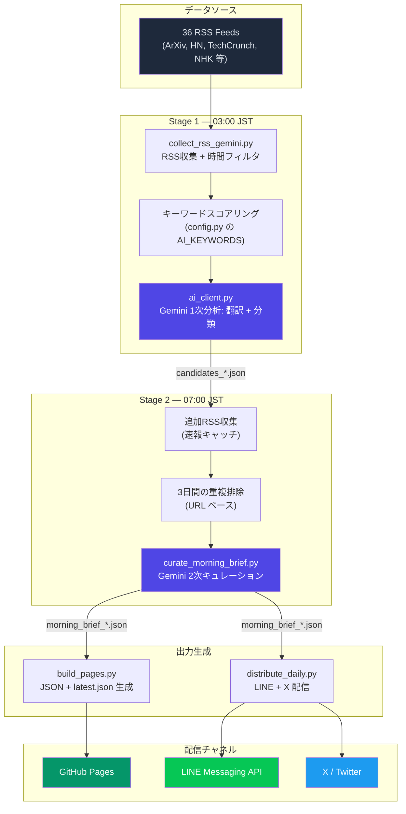

<p align="center">
  <h1 align="center">🤖 AI News Bot</h1>
  <p align="center">
    <strong>世界のAIニュースを、朝7時に日本語で届ける完全自動パイプライン</strong>
  </p>
  <p align="center">
    <a href="https://github.com/TadFuji/ai-news-bot/actions/workflows/daily_rss_gemini.yml"></a>
    <a href="https://github.com/TadFuji/ai-news-bot/actions/workflows/collect_candidates.yml"></a>
    <a href="https://opensource.org/licenses/MIT"></a>
    <a href="https://www.python.org/downloads/"></a>
    <a href="https://deepmind.google/technologies/gemini/"></a>
  </p>
  <p align="center">
    <a href="https://tadfuji.github.io/ai-news-bot/">📰 公開ポータル</a> ·
    <a href="#-クイックスタート">⚡ クイックスタート</a> ·
    <a href="#-アーキテクチャ">🏗️ アーキテクチャ</a> ·
    <a href="README_EN.md">🇺🇸 English</a>
  </p>
</p>

---

## 📖 概要

世界中の膨大なAIニュースから、**日本の40代ビジネスリーダー**にとって真に価値のある情報だけを抽出し、日本語で要約・配信する**完全自動化パイプライン**です。

> 「情報の海で溺れない、賢明な判断を下すための羅針盤」

**サーバー維持費ゼロ** — GitHub Actions 上で完結し、GitHub Pages・LINE・X (Twitter) の3チャネルへ毎朝自動配信します。

### パイプライン概要

| ステージ | 時刻 (JST) | 処理内容 | 出力 |
|---------|-----------|---------|------|
| **収集** | 03:00 | 36の RSSフィードをクロール、キーワードスコアリング | 約100件の候補記事 |
| **1次分析** | 03:00 | Gemini で翻訳・分類・スコアリング・So What分析 | Top 30 スコアリング済み |
| **2次キュレーション** | 07:00 | Gemini 編集キュレーション（テーマ・コメント・重複排除） | **朝刊 Top 10** |
| **配信** | 07:00 | マルチチャネル同時配信 | Web / LINE / X |
| **週刊コラム** | 日曜 09:00 | AIが執筆するエッセイ形式のコラム | コラム + LINE配信 |

### 配信チャネル

- 🌐 **[GitHub Pages ポータル](https://tadfuji.github.io/ai-news-bot/)** — 国内版・グローバル版のダークモード対応アーカイブ
- 📱 **LINE** — Flex Message で Top 3 をプッシュ通知
- 🐦 **X (Twitter)** — 長文スレッド形式で配信

---

## 🎯 編集方針（Editorial Policy）

AIを単なる翻訳機ではなく、**「AIトレンドアナリスト」**として定義し、以下の3つの基準で情報を厳選します：

1. **生存戦略** — 「この技術は私たちの働き方をどう変えるか？」
2. **リスク管理** — 「教育・著作権・セキュリティの観点で何に注意すべきか？」
3. **身近な利便性** — 「LINEやExcelなど、日常ツールがどう進化したか？」

---

## 🏗️ アーキテクチャ

GitHub Actions を中核とした、モダンなサーバーレス・アーキテクチャです。



### 耐障害設計

| 機能 | 説明 |
|-----|------|
| **リトライ** | Gemini API 呼び出しを最大2回、指数バックオフで再試行 |
| **フォールバック** | API障害時は翻訳済みフィールド (`title_ja`, `summary_ja`) を使用 |
| **ヘルスチェック** | フォールバック発動時に LINE 障害通知 + GitHub Actions を赤ステータスに |
| **重複排除** | 3日間のローリングウィンドウで同じ記事の再配信を防止 |

---

## 📂 プロジェクト構造

```
ai-news-bot/
├── .github/workflows/          # GitHub Actions（日次・週次・リント）
│   ├── daily_rss_gemini.yml    #   メインパイプライン: Stage 1 + 2
│   ├── collect_candidates.yml  #   Stage 1 のみ (03:00 JST)
│   ├── weekly_column.yml       #   日曜コラム生成
│   └── lint.yml                #   コード品質チェック
│
├── config.py                   # RSSソース (36件), AIキーワード, 設定
├── rss_client.py               # RSS フィードパーサー
│
├── collect_rss_gemini.py       # Stage 1: 収集 + スコアリング + 1次分析
├── ai_client.py                # Gemini API クライアント（プロンプト設計）
├── curate_morning_brief.py     # Stage 2: 2次キュレーション + オーケストレーション
│
├── build_pages.py              # 静的サイト生成（GitHub Pages 用 JSON/HTML）
├── distribute_daily.py         # マルチチャネル配信オーケストレーター
├── line_notifier.py            # LINE Messaging API（Flex Message 対応）
│
├── generate_weekly_column.py   # 週刊コラム（AIエッセイ）生成
├── db_utils.py                 # データベース共通ユーティリティ
├── save_to_db.py               # 国内ニュース → SQLite/MySQL
├── save_global_news.py         # グローバルニュース → SQLite/MySQL
├── monitor_models.py           # 月次AIモデルリリース監視
│
├── app.py                      # Streamlit ダッシュボード（管理用）
├── generators/                 # PDFレポート・動画生成
├── docs/                       # GitHub Pages（公開ディレクトリ）
├── output/                     # 中間生成物（gitignored）
│
├── .env.example                # 環境変数テンプレート
├── requirements.txt            # Python 依存関係
├── CONTRIBUTING.md             # 貢献ガイドライン
├── HISTORY.md                  # 変更履歴
├── SECURITY.md                 # セキュリティポリシー
└── LICENSE                     # MIT ライセンス
```

---

## ⚡ クイックスタート

### 前提条件

- Python 3.10 以上
- [Google AI Studio API Key](https://aistudio.google.com/apikey)（Gemini 用）

### インストール

```bash
# リポジトリのクローン
git clone https://github.com/TadFuji/ai-news-bot.git
cd ai-news-bot

# 仮想環境の作成
python -m venv .venv
source .venv/bin/activate  # Linux/macOS
# .venv\Scripts\activate   # Windows

# 依存関係のインストール
pip install -r requirements.txt

# 環境変数の設定
cp .env.example .env
# .env を編集して API キーを設定
```

### 環境変数

| 変数名 | 必須 | 説明 |
|--------|------|------|
| `GOOGLE_API_KEY` | ✅ | Google AI Studio の API キー（Gemini 用） |
| `LINE_CHANNEL_ACCESS_TOKEN` | 任意 | LINE Messaging API アクセストークン |
| `LINE_USER_ID` | 任意 | LINE 配信先ユーザー/グループ ID |
| `X_CONSUMER_KEY` | 任意 | X (Twitter) API コンシューマーキー |
| `X_CONSUMER_SECRET` | 任意 | X (Twitter) API コンシューマーシークレット |
| `X_ACCESS_TOKEN` | 任意 | X (Twitter) アクセストークン |
| `X_ACCESS_TOKEN_SECRET` | 任意 | X (Twitter) アクセストークンシークレット |

### ローカル実行

```bash
# Stage 1: ニュース収集・分析
python collect_rss_gemini.py

# Stage 2: キュレーション・配信
python curate_morning_brief.py

# 週刊コラム生成
python generate_weekly_column.py

# 管理ダッシュボード起動
streamlit run app.py
```

### GitHub Actions でのデプロイ

1. このリポジトリを Fork
2. **Settings → Secrets → Actions** で `GOOGLE_API_KEY` を設定
3. （任意）LINE / X のクレデンシャルを追加
4. 毎日 03:00 と 07:00 JST に自動実行されます

---

## 🧠 AI キュレーションの仕組み

Gemini 3 Flash Preview を使った**2段階キュレーション**設計です。

### 1次分析 — アナリストモード (`ai_client.py`)

AIに**「シニアAIトレンドアナリスト」**のペルソナを定義。各記事に対して：

- タイトル・要約を自然な日本語に翻訳
- カテゴリ分類（最新技術 / 業務効率化 / 法規制・倫理 等）
- **So What?** 分析（ビジネスインパクトの解説）
- 重要度を 1-10 でスコアリング

### 2次キュレーション — 編集長モード (`curate_morning_brief.py`)

AIが**編集長**として、スコアリング済み候補から最終 Top 10 を選定：

- その日のニュースを一本の物語として繋ぐ**テーマ**を生成
- 編集者目線の**朝刊コメント**を執筆
- 各記事の**一言要約**と**アクションアイテム**を作成
- カテゴリの多様性を担保（同一カテゴリ最大3件）

---

## 🔧 カスタマイズ

### RSS ソースの追加

`config.py` を編集してフィードを追加：

```python
RSS_FEEDS = [
    "https://example.com/rss",
    # 現在 36 フィードを設定済み
]
```

### AI キーワードの調整

```python
AI_KEYWORDS = [
    "artificial intelligence", "machine learning", "LLM",
    "生成AI", "大規模言語モデル",
    # 網羅的なキーワードリスト
]
```

---

## 🤝 コントリビューション

バグ報告、新規 RSS ソースの推薦、プロンプト改善提案を歓迎します！
詳細は [CONTRIBUTING.md](CONTRIBUTING.md) をご覧ください。

**特に歓迎する貢献：**
- 🌐 新しい RSS フィードソース（日英以外の言語も）
- 🧪 パースやキュレーションロジックのユニットテスト
- 🎨 GitHub Pages の UI 改善
- 📊 分析ダッシュボード機能

---

## 📄 ライセンス

MIT License — 詳細は [LICENSE](LICENSE) を参照してください。

---

<p align="center">
  Built with ❤️ by <a href="https://github.com/TadFuji">Tad Fuji</a> · Powered by <a href="https://deepmind.google/technologies/gemini/">Gemini 3 Flash Preview</a>
</p>
