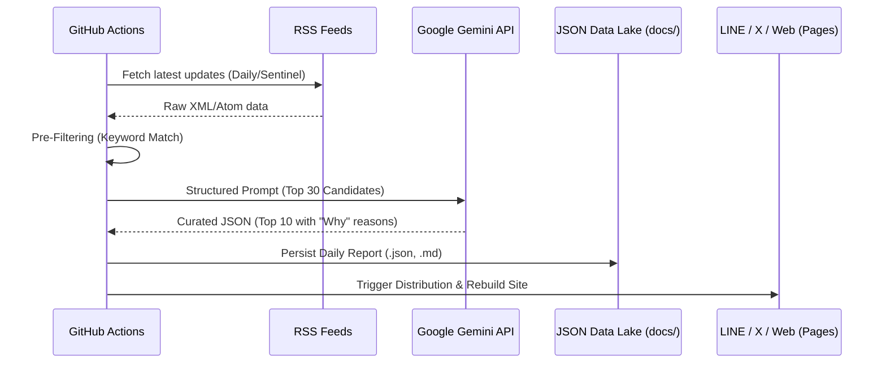

# System Architecture: AI News Bot

This document outlines the technical design principles and data flow of the AI News Bot project.

## 🏗 Modular Components

The system is designed with a strict separation of concerns (SoC), allowing each module to be independently tested or replaced.

### 1. Discovery Layer (`rss_client.py`)
- **Responsibility**: Fetching raw data from heterogeneous RSS feeds.
- **Handling**: Normalizes various RSS formats (XML, Atom, RSS 2.0) into a unified internal Python dictionary format.
- **Concurrency**: (Planned) Using `asyncio` for faster concurrent fetching of many feeds.

### 2. Intelligent Filtering Layer (`collect_rss_gemini.py`)
- **Phase A (Pre-Selection)**: Keyword-based scoring (`AI_KEYWORDS`). This stage filters 1000+ candidate articles down to a manageable "Top 30" context window for the LLM.
- **Phase B (Contextual Selection)**: The LLM (Gemini 3 Flash Preview) acts as a high-level gatekeeper, using a complex prompt to judge relevance against a specific target persona (40-year-old Japanese business-person).

### 3. Generation Engine (`ai_client.py`)
- **Translation & Contextualization**: Not just translating, but explaining *why* a globally relevant technological breakthrough matters locally in Japan.
- **Structured Output**: Enforces strict JSON schema output from the LLM to ensure the downstream build process is deterministic and error-free.

### 4. Build & Distribution Layer (`build_pages.py` & `distribute_daily.py`)
- **Static Site Generation**: Uses Jinja2-like patterns to hydrate HTML templates with daily JSON data.
- **Multi-Channel Push**: Orchestrates API calls to LINE Messaging API and Tweepy (X API) to broadcast the curated insights.

## 🔄 Data Pipeline Flow

## 🛡️ Operational Reliability

- **Graceful Error Handling**: The system includes fallbacks for API timeouts or malformed LLM responses.
- **Stateless Execution**: Running entirely in GitHub Actions means there's no server state to manage. All state (history, reports) is persisted via Git commits into the repository itself.
- **Scalable Context**: By using a two-stage filtering process, we overcome LLM token limits while still being able to monitor hundreds of feeds simultaneously.

---
*Created by the Antigravity Engineering Team.*
