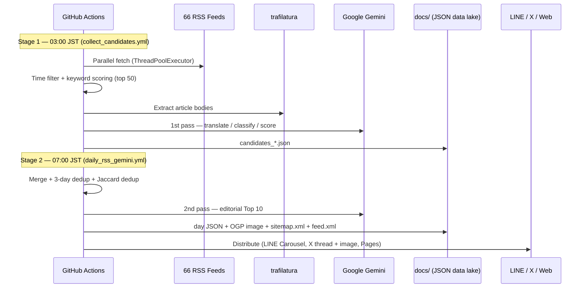

# System Architecture: AI News Bot

This document describes the technical design and data flow of the AI News Bot — a serverless pipeline that turns the daily flood of global AI news into a curated Japanese morning brief, running entirely on GitHub Actions.

## 🏗 Design Principles

- **Separation of Concerns** — each stage (discovery, extraction, scoring, generation, distribution) is an independently testable module.
- **Two-stage curation** — a cheap keyword pre-filter narrows hundreds of articles to a manageable set before the LLM acts as editor, keeping token cost bounded.
- **Fail loud, degrade gracefully** — API failures fall back to pre-translated fields and raise a LINE alert + non-zero exit so failures are visible, not silent.

## 🔩 Modular Components

### 1. Discovery (`rss_client.py`, `config.py`)
- Fetches **66** heterogeneous RSS/Atom feeds (US / EU / China / Japan — news sites, newsletters, and lab blogs).
- **Concurrency:** feeds are fetched in parallel via `ThreadPoolExecutor` (implemented).
- Normalizes XML / Atom / RSS 2.0 into a unified internal dictionary.

### 2. Pre-filtering (`collect_rss_gemini.py`)
- Time filter (last 24h) + keyword scoring against `AI_KEYWORDS` — including Chinese terms so China sources are not scored 0.
- Narrows to the top `STAGE1_MAX_ARTICLES` (**50**) candidates before the LLM is invoked.

### 3. Body extraction (`article_extractor.py`)
- For the highest-scored candidates, fetches the full article body via `trafilatura` (a richer signal than the RSS summary), capped to keep prompt size bounded.

### 4. Generation (`ai_client.py`)
- Gemini (`gemini-3-flash-preview`) acts as a "Senior AI Trend Analyst": translates to Japanese, classifies into **7 categories** (対話型AI / 画像・動画AI / 中国AI / ビジネス活用 / リスク・規制 / 日本市場 / 研究・技術), scores 1–10, and writes a "So What?" (one-liner / why-important / action-item).
- A response schema enforces **structured JSON output** so the downstream build is deterministic.

### 5. Editorial curation & dedup (`curate_morning_brief.py`, `dedup.py`)
- `dedup.py` collapses near-duplicate stories (Jaccard similarity over Japanese titles) so the same event reported by different outlets is bundled.
- A 3-day rolling window removes already-delivered URLs.
- Gemini then acts as **editor**: picks a daily theme, writes the morning comment, and selects the final **Top 10**. A source-diversity guardrail caps any single source at 3.

### 6. Build & distribution (`build_pages.py`, `distribute_daily.py`, `line_notifier.py`)
- `build_pages.py` generates the GitHub Pages assets: per-day JSON, `latest.json`, `archive.json`, columns — plus an **OGP image** (`generators/infographic_maker.py`), **JSON-LD** structured data, **static prerendering** (crawler-visible HTML), **`sitemap.xml`**, and an **RSS `feed.xml`**. Externally-sourced strings are sanitized (`_json_for_script`, `_safe_http_url`) to prevent XSS in the public pages.
- `distribute_daily.py` posts to X (single or threaded via `X_THREAD_MODE`, with an OGP image card); `line_notifier.py` sends a LINE **Flex Carousel** with per-article buttons.

## 🗄 State

Compute is near-stateless, but state is persisted in two places:

- **Git** — daily JSON/HTML reports are committed back into the repository; `docs/` is the durable "data lake".
- **SQLite** (`ai_news.db`) — an accumulated article store used by the admin / analytics tooling (`db_utils.py`, `save_to_db.py`). *(Note: the pipeline is not fully stateless — this DB is the long-term store.)*

## 🔄 Data Pipeline Flow

```mermaid
sequenceDiagram
    participant GH as GitHub Actions
    participant RSS as 66 RSS Feeds
    participant TR as trafilatura
    participant GM as Google Gemini
    participant DB as docs/ (JSON data lake)
    participant SNS as LINE / X / Web

    Note over GH: Stage 1 — 03:00 JST (collect_candidates.yml)
    GH->>RSS: Parallel fetch (ThreadPoolExecutor)
    GH->>GH: Time filter + keyword scoring (top 50)
    GH->>TR: Extract article bodies
    GH->>GM: 1st pass — translate / classify / score
    GH->>DB: candidates_*.json

    Note over GH: Stage 2 — 07:00 JST (daily_rss_gemini.yml)
    GH->>GH: Merge + 3-day dedup + Jaccard dedup
    GH->>GM: 2nd pass — editorial Top 10
    GH->>DB: day JSON + OGP image + sitemap.xml + feed.xml
    GH->>SNS: Distribute (LINE Carousel, X thread + image, Pages)
```

## 🛡️ Operational Reliability

- **Retry with backoff** — Gemini calls retry up to 2× with exponential backoff.
- **Graceful fallback** — on failure, pre-translated `title_ja` / `summary_ja` are used, a LINE alert fires, and the job exits non-zero (red CI).
- **Isolated failures** — OGP / sitemap / feed generation and image upload are wrapped so a failure never blocks delivery.
- **XSS hardening** — all externally-sourced strings are escaped before entering HTML, JSON-LD, or `href` attributes.

---
*Maintained alongside the codebase. See the [README](../README.md) for usage and setup.*
